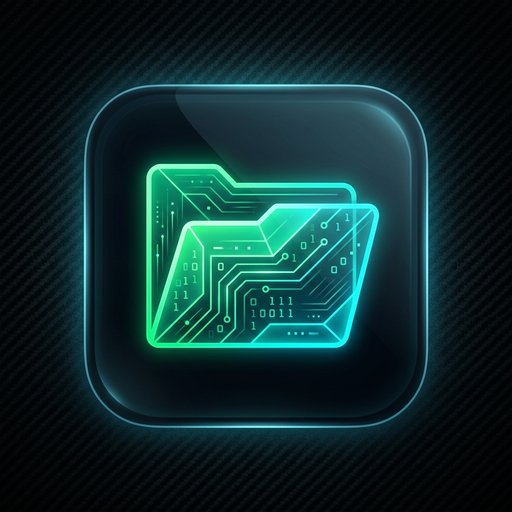

# BitFM — The Next-Gen Linux File Manager

<div align="center">



<br/>


[](https://github.com/zonicisalive/BitFM/stargazers)
[](https://github.com/zonicisalive/BitFM/issues)
[](https://github.com/zonicisalive/BitFM/commits)

**A fast, modern, and modular Linux file manager engineered with C++ and Qt.**  
*Crafted for speed, pixel-perfect aesthetics, and seamless integration on Wayland (Niri, Hyprland, Sway, GNOME, KDE Plasma, Cosmic) & X11.*

</div>

---

## Features & Capabilities

- **High-Performance C++ Core**: Zero-overhead asynchronous directory loading, non-blocking recursive search, and low-latency file operations.
- **Wayland Acrylic Translucency & Hardware Blur**:
  - Full `Qt::WA_TranslucentBackground` integration with native compositor blur (*Hyprland, Niri, Sway, Wayfire, KDE KWin*).
  - Dynamic RGBA color token mapping with live opacity slider (40%–100%) and translucency toggle in Theme Controller Studio.
- **Three View Modes**:
  - **Icon Grid (`Ctrl+1`)**: Modern card-style grid with edge-to-edge justification, centered icons, symlink emblems, folder item counts, and 3-line file metadata.
  - **Detailed List (`Ctrl+2`)**: Full-featured tabular view with interactive resizable columns, sorting indicators, and date/size formatting.
  - **Compact View (`Ctrl+3`)**: Flowing multi-column horizontal list with scalable icons, dynamic row heights, and zoom support.
- **Theme Controller Studio (`Ctrl+Shift+T`)**:
  - **10 Built-in Presets**: *Modern GNOME (Adwaita Dark)*, *OLED Pitch Black*, *Midnight Cyberpunk*, *Nord Frost*, *Gruvbox Warm Dark*, *Dracula Gothic*, *Rosé Pine*, *GitHub Dark*, *Catppuccin Mocha*, *Pure Light*.
  - **Accent Color Studio**: 9 instant presets with custom RGB/HEX color picker.
  - **Live External Theme Sync**: Inotify watcher on `~/.config/BitFM/theme.conf` and `~/.config/BitFM/theme.json` to dynamically synchronize colors in real time.
- **Universal Zoom Persistence**:
  - Real-time zoom level synchronization across all tabs, dual panes, and file chooser dialogs with persistence in `~/.config/BitFM/bitfm.conf`.
- **Smart Clipboard & Cut Feedback**:
  - **Visual Cut Dimming**: Cut files (`Ctrl+X`) are dynamically rendered with ghosted translucency across Grid, List, and Compact views until pasted or cancelled.
  - **Clean Single-Payload Wayland Clipboard**: Formats standard `text/uri-list` and file paths without polluting clipboard managers.
- **Archive Compression & Extraction with Real-time Progress Bar**:
  - Multi-file compression (`.zip`, `.tar.xz`, `.tar.gz`) and extraction (`Extract Here`, `Extract to Folder`).
  - Interactive progress dialog displaying the active file name, item count (`X of Y items`), animated 0%–100% progress bar, and instant cancellation.
- **Native XDG Desktop Portal File Chooser (`bitfm --portal`)**:
  - Handles system-wide Save File and Open File dialogs for web browsers (Firefox, Chrome, Brave, Chromium), Discord, GIMP, and desktop apps.
  - **Batch Multi-File Selection**: Full multi-selection support returning complete URI lists.
  - **File Type Filtering with Folder Navigation**: Category filtering (*Images, Documents, Media, All Files*) while keeping folder structures browsable.
- **D-Bus File Manager Specification (`org.freedesktop.FileManager1`)**:
  - **Browser "Show in Folder" Highlighting**: Seamless integration with Firefox, Chrome, Brave, Chromium, and desktop apps. Automatically focuses the window, navigates to the target directory, selects the downloaded file, and scrolls to center it.
  - **CLI File Targeting**: Run `bitfm --select <file>` or `bitfm /path/to/file` to instantly focus and highlight files in existing or new windows.
- **Instant Filter & Recursive Search (`Ctrl+F`)**:
  - **Instant In-Folder Filter**: Zero-latency file filtering as you type.
  - **Async Subdirectory Scanner**: Multi-threaded background recursive search supporting plain text and regular expressions without UI stutter.
- **Live File Inspector (`F4`)**:
  - **Video Previews**: Generates thumbnail frames with duration info.
  - **PDF Rendering**: High-fidelity first-page document previews.
  - **Audio Inspection**: Extracts bitrate, sample rate, and track duration.
  - **Checksum Calculation**: Fast asynchronous SHA-256 hash generation.
- **Dual-Pane (`F3`) & Tabbed Navigation (`Ctrl+T`)**: Browse independent directories side-by-side with full drag-and-drop and clipboard synchronization.
- **Integrated Terminal Drawer (`F12`)**: Dropdown terminal embedded inside the window, automatically synchronized to your active directory.
- **Quick Look Floating Preview (`Space`)**: Instant floating preview popup for videos, PDFs, images, and source code with syntax highlighting.
- **Vim Navigation**: Full keyboard navigation support (`j`, `k`, `h`, `l`, `g`, `G`, `/`, `.`, `Space`).
- **Open With Desktop Integration**: Scan and launch any installed XDG application with smart MIME type recommendations and custom commands.
- **Storage & Hardware Integration**: Smart partition filtering, interactive LUKS/BitLocker encrypted drive unlocking, and remote GVFS server mounts (SFTP, SMB, FTP, WebDAV).

---

## Keyboard Shortcuts

| Shortcut | Action |
| :--- | :--- |
| **`Ctrl + 1`** | Switch to Icon Grid View |
| **`Ctrl + 2`** | Switch to Detailed List View |
| **`Ctrl + 3`** | Switch to Compact View |
| **`Ctrl + Shift + T`** | Open Theme Controller Studio |
| **`Ctrl + T`** | Open New Tab |
| **`Ctrl + W`** | Close Current Tab |
| **`Ctrl + F`** / **`/`** | Toggle Instant Search Bar |
| **`F3`** | Toggle Dual Pane Split View |
| **`F4`** | Toggle File Inspector Panel |
| **`F12`** | Toggle Dropdown Terminal Drawer |
| **`Space`** | Floating Quick Preview (Video/PDF/Image/Code) |
| **`Ctrl + L`** | Focus / Edit Location Breadcrumb Bar |
| **`Ctrl + H`** / **`.`** | Toggle Hidden Files (`.dotfiles`) |
| **`Ctrl + B`** | Toggle Places / Devices Sidebar |
| **`Ctrl + M`** | Toggle Menu Bar |
| **`j` / `Down`** | Move Cursor Down |
| **`k` / `Up`** | Move Cursor Up |
| **`h` / `Alt + Up`** | Navigate to Parent Folder |
| **`l` / `Enter`** | Open Selected File / Enter Directory |
| **`g`** | Jump to Top of Folder |
| **`G`** | Jump to Bottom of Folder |
| **`Ctrl + +` / `Ctrl + =`** | Zoom In Icon Size |
| **`Ctrl + -`** | Zoom Out Icon Size |
| **`Ctrl + 0`** | Reset Zoom Level |
| **`Ctrl + R` / `F5`** | Refresh Directory |
| **`Alt + Left` / `Backspace`** | Navigate Back |
| **`Alt + Right`** | Navigate Forward |
| **`Alt + Home`** | Navigate to User Home |
| **`Ctrl + A`** | Select All Items |
| **`Delete`** | Move Selected Items to Trash |
| **`Shift + Delete`** | Permanently Delete Selected Items |
| **`Esc`** | Close Search Bar / Dialogs / Popups |

---

## Build & Installation

### 1. Install Dependencies

#### **Arch Linux / Manjaro / EndeavourOS**
```bash
sudo pacman -S --needed \
    base-devel \
    cmake \
    qt6-base \
    udisks2 \
    ffmpegthumbnailer \
    ffmpeg \
    poppler-glib
```

#### **Debian / Ubuntu / Linux Mint**
```bash
sudo apt update
sudo apt install -y \
    build-essential \
    cmake \
    qt6-base-dev \
    libudisks2-dev \
    ffmpegthumbnailer \
    ffmpeg \
    poppler-utils
```

#### **Fedora / RHEL**
```bash
sudo dnf install -y \
    gcc-c++ \
    cmake \
    qt6-qtbase-devel \
    udisks2-devel \
    ffmpegthumbnailer \
    ffmpeg \
    poppler-utils
```

---

### 2. Quick Install (Recommended)

```bash
# Clone the repository
git clone https://github.com/zonicisalive/BitFM.git
cd BitFM

# Run the universal installer (auto-detects dependencies and sets up Wayland portals)
./install.sh

# Or install system-wide:
# sudo ./install.sh --system
```

### 3. Manual Compilation

```bash
mkdir -p build && cd build
cmake ..
make -j$(nproc)
./bitfm
```

---

## Configuration & Theming

### 1. Session Preferences
Saved automatically to `~/.config/BitFM/bitfm.conf` (view modes, zoom levels, window geometry, splitters).

### 2. External Theme Synchronization
BitFM monitors `~/.config/BitFM/theme.conf` and `~/.config/BitFM/theme.json` in real time. External theme managers or scripts can write color definitions:

```ini
# ~/.config/BitFM/theme.conf
name=Custom Dynamic Theme
is_dark=true
background=#131614
surface=#1a1c1b
overlay=#282a29
hover=#333534
selection=#749d8a
border=#434844
accent=#a5d0bb
foreground=#e2e2e0
```

---

## Support

If BitFM saves you time, a star helps more people find it.

- **Found a bug or have a feature idea?** [Open an issue](https://github.com/zonicisalive/BitFM/issues)
- **Questions or feedback?** [support@zonicisalive.com](mailto:support@zonicisalive.com)
- **More from the author:** [zonicisalive.com](https://zonicisalive.com) · [@zonicisalive](https://github.com/zonicisalive)

---

## License

Distributed under the **GPL-3.0 License**. See `LICENSE` for more information.
